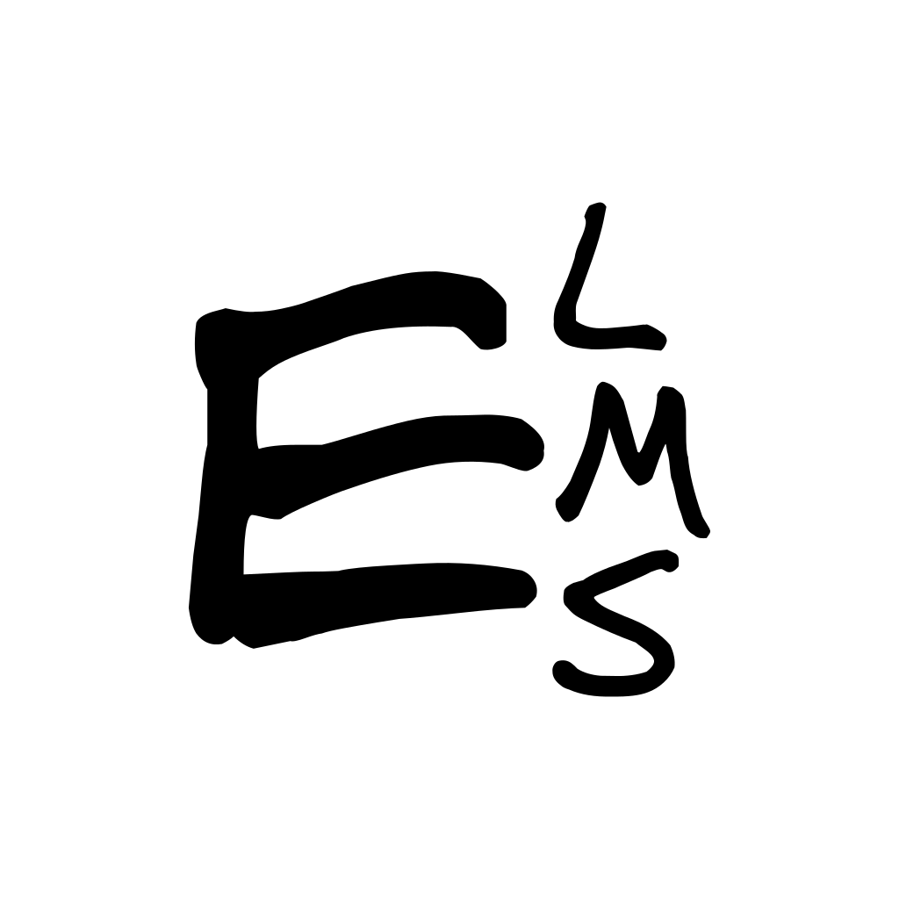

# ELEMES

<div align="center">
  
  
  **LMS but only the exam part :D**
  
  A modern examination platform built with TanStack Start and Mantine UI
</div>

## 🚀 Quick Start

The easiest way to get started is using the provided DevContainer configuration:

1. **Prerequisites:**

   - [Docker](https://docs.docker.com/get-docker/)
   - [VS Code](https://code.visualstudio.com/) with [Dev Containers extension](https://marketplace.visualstudio.com/items?itemName=ms-vscode-remote.remote-containers)

2. **Open in DevContainer:**

   - Press `Ctrl+Shift+P` (or `Cmd+Shift+P` on Mac)
   - Select "Dev Containers: Reopen in Container"
   - Wait for the container to build and start

3. **Start development:**
   ```bash
   npm run dev
   ```

The development server will be available at `http://localhost:3000`

## 🐳 Production Deployment

See [compose.yml](./compose.yml) for the production setup.

Deploy with:

```bash
docker-compose up -d
```

## 🛠️ Development

### Database Migrations

see [migrate guide](https://github.com/golang-migrate/migrate/tree/master/cmd/migrate) for details on how to manage database migrations.

### Project Structure

```
├── src/
│   ├── components/          # Reusable UI components
│   ├── routes/             # File-based routing
│   ├── lib/                # Utilities and configurations
│   ├── mantine/            # Mantine theme customization
│   └── types/              # TypeScript type definitions
├── migrations/             # Database migrations
├── public/                 # Static assets
├── .devcontainer/          # DevContainer configuration
└── scripts/                # Build and deployment scripts
```

## 📦 Tech Stack

- **Framework:** [TanStack Start](https://tanstack.com/start)
- **UI Library:** [Mantine](https://mantine.dev/)
- **Database:** PostgreSQL
- **Authentication:** [Better Auth](https://www.better-auth.com/)
- **Styling:** PostCSS with Mantine
- **TypeScript:** Full type safety
- **Package Manager:** npm

## 📝 License

This project is open-sourced software licensed under the [MIT License](./LICENSE).

## 🙏 Acknowledgments

- [TanStack](https://tanstack.com/) for the amazing router and query tools
- [Mantine](https://mantine.dev/) for the beautiful UI components
- [Better Auth](https://www.better-auth.com/) for authentication
